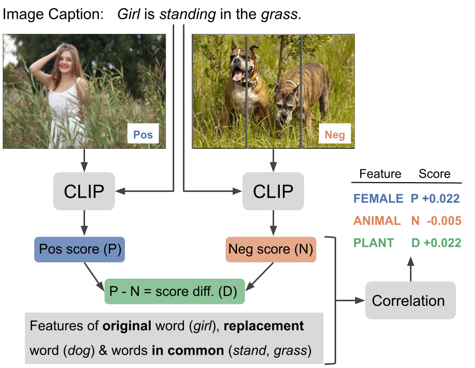

# Scalable VLM Probing

In this work, we proposed a simple and effective method to **probe vision-language models**. 

Our method is **scalable**, as it does not require data annotation and makes use of existing datasets. 
With our method, we analyzed the performance of **CLIP**, a popular state-of-the-art multi-modal model, on the **SVO-Probes** benchmark. 

We hope our work contributes to ongoing efforts to discover the limitations of multi-modal models and help build more robust and reliable systems. 
Our framework can be easily used to analyze other benchmarks, features, and multi-modal models




## Setup

With Python >= 3.8, run the following commands:

```bash
pip install -r requirements.txt
python -c "import nltk; nltk.download(['omw-1.4', 'wordnet'])"
spacy download en_core_web_trf
huggingface-cli login
```
